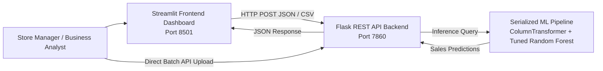

# 🛒 SuperKart Sales Forecasting & Deployment Project
---
### **End-to-End Enterprise Demand & Revenue Forecasting Solution**

[](https://www.python.org/)
[](https://scikit-learn.org/)
[](https://flask.palletsprojects.com/)
[](https://streamlit.io/)
[](https://www.docker.com/)
[](https://github.com/codespaces)

---

## 📌 Executive Summary

**SuperKart** is a premier multi-city retail enterprise operating supermarkets, departmental stores, and food marts across Tier 1, Tier 2, and Tier 3 cities. Accurate quarterly sales revenue forecasting is essential to:
1. **Optimize Supply Chain & Procurement:** Minimize holding costs and eliminate stockouts.
2. **Prevent Perishable Spoilage:** Align inventory replenishment with demand velocities.
3. **Format & Territory Expansion:** Guide capital investments in top-performing retail store types.

This repository provides an **end-to-end production ML system**: from exploratory data analysis and feature engineering to hyperparameter-tuned ensemble modeling, model serialization (`joblib`), a decoupled **Flask REST API** backend, and an interactive **Streamlit frontend** dashboard supporting both **single-item** and **bulk CSV batch inference**.

---

## 💻 Validation on GitHub Codespaces (Step-by-Step)

You can validate the entire deployment inside **GitHub Codespaces** in minutes without installing Docker locally or setting up third-party cloud hosting:

### Step 1: Create a Codespace
1. Navigate to the repository: [https://github.com/shivam777ie/SuperKart-Forecasting-Project](https://github.com/shivam777ie/SuperKart-Forecasting-Project)
2. Click the green **Code** button, select the **Codespaces** tab, and click **Create codespace on main**.
3. GitHub will open a full VS Code browser workspace.

### Step 2: Launch Backend and Frontend Containers
In the Codespace terminal, run:
```bash
docker compose up -d --build
```
*This automatically builds both container images, sets up the bridge network `superkart_network`, runs the Flask API on port **7860**, and runs the Streamlit UI on port **8501**.*

To verify both containers are running:
```bash
docker ps
```

### Step 3: Configure Ports (Set Port 7860 to Public)
1. In the bottom panel of Codespaces, switch to the **Ports** tab.
2. You will see Port **7860 (Flask Backend)** and Port **8501 (Streamlit Frontend)** listed.
3. Right-click on Port **7860** ➔ **Port Visibility** ➔ **Public** *(required for external API calls from notebooks or Colab)*.
4. Copy the **Forwarded Address** for Port 7860 (e.g. `https://<codespace-name>-7860.app.github.dev`).

### Step 4: Validate Online & Batch Inference in Codespaces

#### A. Test Health Check:
```bash
curl http://localhost:7860/health
```

#### B. Test Online Single Prediction:
```bash
curl -X POST http://localhost:7860/v1/predict \
     -H "Content-Type: application/json" \
     -d '{
       "Product_Weight": 12.66,
       "Product_Sugar_Content": "Low Sugar",
       "Product_Allocated_Area": 0.027,
       "Product_MRP": 117.08,
       "Store_Size": "Medium",
       "Store_Location_City_Type": "Tier 2",
       "Store_Type": "Supermarket Type2",
       "Product_Id_char": "FD",
       "Store_Age_Years": 16,
       "Product_Type_Category": "Non Perishables"
     }'
```
*Expected Output:*
```json
{
  "currency": "USD",
  "formatted_sales": "$2,934.01",
  "prediction": 2934.01,
  "status": "success"
}
```

#### C. Test Batch Inference (CSV Upload):
```bash
curl -X POST http://localhost:7860/v1/predictbatch \
     -F "file=@Batch_Data_SuperKart.csv"
```
*Expected Output: JSON mapping row index to predicted sales:*
```json
{"0":4103.09,"1":2960.41,"2":4007.96,"3":2046.41,"4":4066.57,"5":5071.21,"6":2396.57,"7":2374.81,"8":4381.44,"9":2395.86}
```

### Step 5: Open Streamlit Frontend
In the **Ports** tab, hover over Port **8501** and click the **Open in Browser** (globe) icon.  
The interactive **SuperKart Sales Forecasting Hub** dashboard will open in a new tab!

---

## 🏗️ System Architecture



---

## 📊 Dataset & Feature Schema

The final model predicts **`Product_Store_Sales_Total`** using 10 engineered and preprocessed features:

| Feature Name | Type | Description |
| :--- | :--- | :--- |
| `Product_Weight` | Numerical | Product weight in kg (4.5 to 22.0 kg) |
| `Product_Sugar_Content` | Categorical | Sugar classification (`Low Sugar`, `Regular`, `No Sugar`) |
| `Product_Allocated_Area` | Numerical | Ratio of display shelf space allocated to product (0.00 to 0.30) |
| `Product_MRP` | Numerical | Maximum retail price in USD ($31.29 to $266.00) |
| `Store_Size` | Categorical | Footprint tier (`Small`, `Medium`, `High`) |
| `Store_Location_City_Type` | Categorical | Urban market tier (`Tier 1`, `Tier 2`, `Tier 3`) |
| `Store_Type` | Categorical | Store format (`Supermarket Type1`, `Supermarket Type2`, `Supermarket Type3`, `Departmental Store`, `Food Mart`) |
| `Product_Id_char` | Categorical | Primary product prefix: `FD` (Food), `DR` (Drinks), `NC` (Non-Consumable) |
| `Store_Age_Years` | Numerical | Operational age calculated as `2025 - Store_Establishment_Year` |
| `Product_Type_Category` | Categorical | Shelf-life classification (`Perishables` vs `Non Perishables`) |

---

## 🏆 Model Performance & Comparison

All models were evaluated on an untouched 20% test partition using **RMSE** as the primary business metric (due to quadratic costs associated with stockouts and spoilage):

| Model Architecture | Train RMSE ($) | Test RMSE ($) | Test MAE ($) | Test R² | Test Adj. R² | Test MAPE (%) |
| :--- | :---: | :---: | :---: | :---: | :---: | :---: |
| **Baseline Random Forest** | 108.92 | 286.16 | 215.84 | 0.928 | 0.927 | 7.92% |
| **Baseline Gradient Boosting** | 302.26 | 308.56 | 239.92 | 0.917 | 0.916 | 8.84% |
| **Baseline XGBoost** | 208.55 | 309.90 | 238.25 | 0.916 | 0.915 | 8.81% |
| **Tuned Gradient Boosting** | 248.81 | 281.79 | 213.62 | 0.930 | 0.929 | 7.78% |
| **Tuned Random Forest (Champion)** | **188.75** | **280.51** | **212.14** | **0.931** | **0.931** | **7.74%** |

### **Key Takeaways:**
- **Champion Model:** **Tuned Random Forest Regressor Pipeline** (`n_estimators=150`, `max_depth=10`, `min_samples_split=5`).
- **Feature Importance:** `Product_MRP` is the dominant sales driver (~55.4%), followed by `Store_Type` (~22.1%) and `Product_Allocated_Area` (~8.7%).

---

## 📁 Repository Structure

```text
SuperKart-Forecasting-Project/
├── .devcontainer/
│   └── devcontainer.json           # GitHub Codespaces configuration
├── backend_files/
│   ├── app.py                      # Flask REST API implementation
│   ├── requirements.txt            # Backend dependencies
│   ├── Dockerfile                  # Backend container configuration (port 7860)
│   └── superkart_model.joblib      # Serialized ML pipeline artifact
├── frontend_files/
│   ├── streamlit_app.py            # Streamlit multi-tab web application
│   ├── requirements.txt            # Frontend dependencies
│   ├── Dockerfile                  # Frontend container configuration (port 7860)
│   └── superkart_model.joblib      # Local model artifact for decoupled resilience
├── docker-compose.yml              # Multi-container orchestration for Codespaces
├── Batch_Data_SuperKart.csv        # 10-record sample dataset for batch inference verification
├── SuperKart.csv                   # Historical training dataset (8,763 rows)
├── superkart_model.joblib          # Standalone root pipeline artifact
├── SuperKart_Sales_Forecasting_Deployment.ipynb   # Complete, executed master Jupyter Notebook
├── SuperKart_Sales_Forecasting_Deployment.html    # Submission-ready exported HTML notebook
├── ShivamsaptputIngle_SuperKart.ipynb             # Candidate submission notebook
├── ShivamsaptputIngle_SuperKart.html              # Candidate submission HTML report
├── .gitignore                      # Git ignore file
└── README.md                       # Comprehensive project documentation
```

---

## 💡 Strategic Business Recommendations

1. **Prioritize Large-Format Supermarkets in Tier 2 Hubs:** Supermarket Type 1 and Type 2 outlets generate over 2x the sales density of Food Marts.
2. **Dynamic Endcap Reallocation:** Maintain product display ratios between 2% and 8%. Items occupying >12% display area without proportional volume should be replaced with mid-to-high MRP packaged goods.
3. **Automate Reordering Cycles:** Integrate the `/v1/predictbatch` API endpoint directly into store ERPs for quarterly automated inventory replenishment.

---

## 👤 Author
**Shivam Ingle**  
*AIML / Data Science & Machine Learning Deployment*  
GitHub: [@shivam777ie](https://github.com/shivam777ie)
